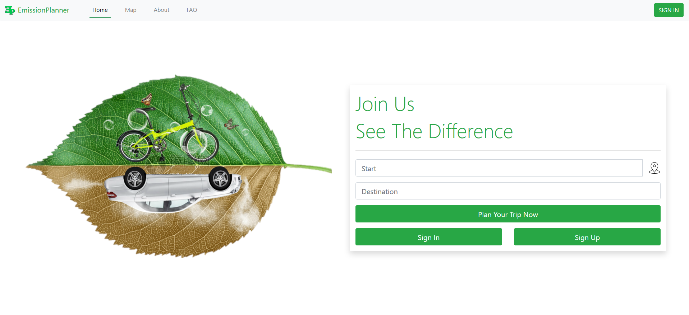
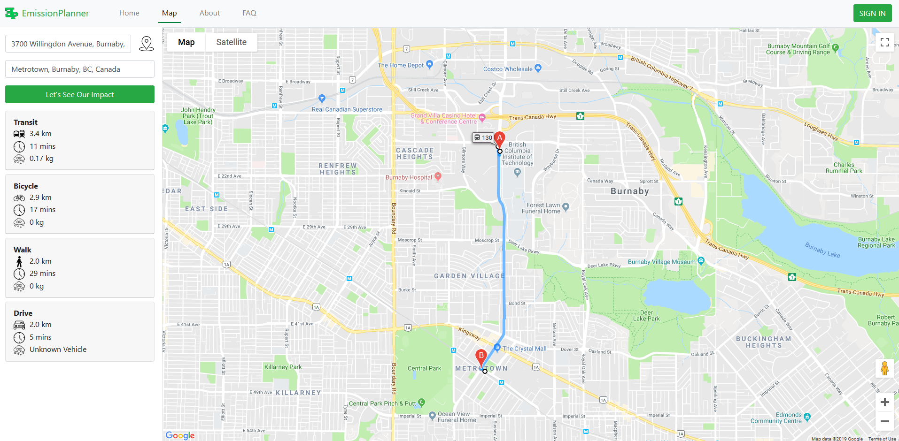

# EmissionsPlanner

Emission Planner was born in the upstairs of the BCIT Burnaby Campus library.
Spring was warming up and the team had been driving around in their cars with
the windows down to get some of that beautiful Vancouver sun. Over the long
rainy winter and early spring, everyone forgot about the big problem with
driving with their windows down and that is the smell and breathing in of
vehicle emission.

The team decided that there needed to be a way to track how much emissions each
car is giving off per trip and to provide alternate transportation methods to
lower the amount of CO2 emissions on our roads.

## Getting Started

Click the [link](http://team-04-comp-2930.firebaseapp.com/) to use the app.

## Walk-Through

- Home Page ..
   

- Map Page
   

## Built With

- Atom
- Visual Studio Code
- Notepad++
- Chrome/Firefox

## Authors

- David Delatycki, Project Manager, <daviddelatycki@gmail.com>
- Bongchul (John) Sin, Technical Support & Front-End, <sbc1142@gmail.com>
- Jeavin Shoker, Design & Front-End, <jshokerwow@gmail.com>
- Min Kong, Research & Front-End, <eoeoms@naver.com>
- Damon Ren, Back-End, <dren7@my.bcit.ca>

## Acknowledgments

- Thanks Carly Orr, Arron Ferguson and other faculty team members for guiding us
through the process and teaching us to think like a user
- Thanks Google Firebase for an easy way to store our database and host our web
app.
- Thanks GitHub for providing a free collaborating/version control platform

## License

Copy Right Reserved. Email For More Info.
